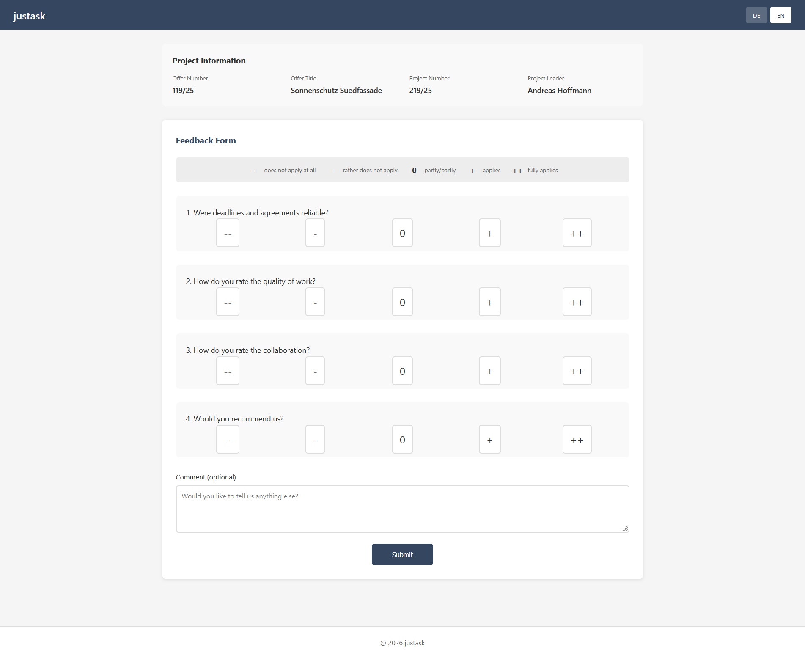
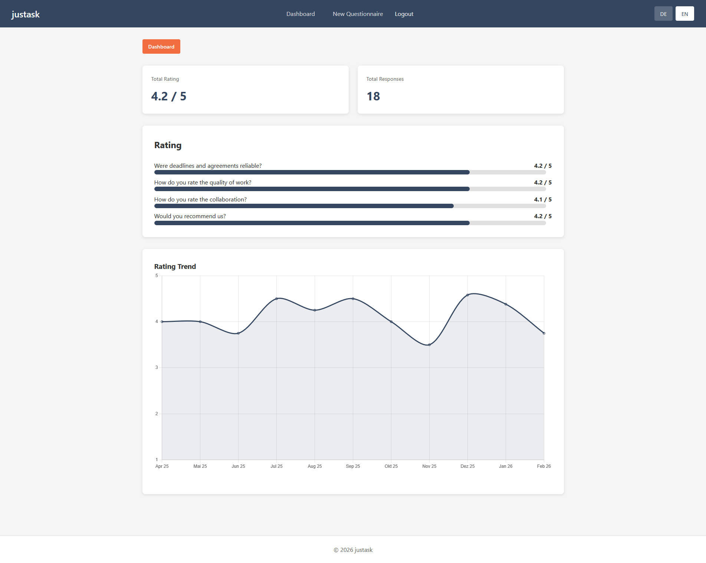
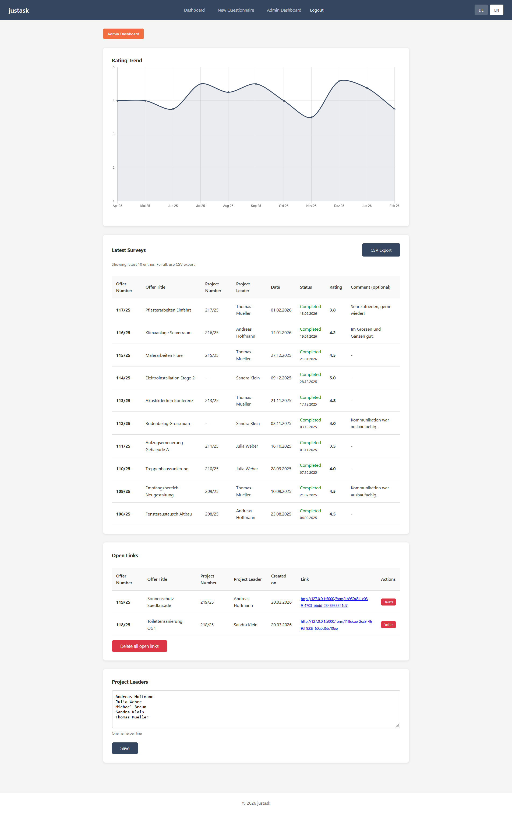

# justask


[](https://github.com/sponsors/scrivoy)

**Minimalist self-hosted feedback tool for SMEs.** Customers rate via one-time links. Staff see dashboards. Admins export data.

## Screenshots

| Customer Form | Staff Dashboard | Admin Dashboard |
|:---:|:---:|:---:|
|  |  |  |

## What it does

A project manager sends a one-time link (or QR code) to the customer. The customer rates anonymously on a 5-point scale and can optionally leave a free-text comment. Staff see aggregated statistics in the dashboard, admins see individual projects and can export CSV data.

## Features

- **Quote-based workflow** — one feedback form per quote, optional project number
- **Anonymous feedback** via one-time link or QR code (UUID token)
- **Free-text comment** at the end of each form
- **Two access levels** — staff (aggregates) and admin (individual data + export)
- **Time series chart** with monthly averages in both dashboards (Chart.js)
- **Admin area** — manage/delete open links, project manager suggestion list, CSV export
- **Notifications** via email and/or webhook (optional)
- **Multilingual** DE/EN, switchable via button
- **CSV export** with English headers (semicolon-delimited, UTF-8)
- **Fully customizable** — branding, questions, UI texts, validation patterns (no code changes needed)

## Tech Stack

- **Backend:** Python, Flask, SQLAlchemy, Flask-Migrate (Alembic)
- **Frontend:** Jinja2, vanilla JS, Chart.js
- **Database:** SQLite
- **Auth:** bcrypt (two shared passwords)
- **Deployment:** gunicorn + Caddy

## Quick Start (Development)

```bash
cd /path/to/justask
python3 -m venv venv
source venv/bin/activate
pip install -r requirements.txt
cp config.env.example config.env   # edit as needed
python init_db.py
flask run
```

Open http://localhost:5000 in your browser. This is for development only — production uses gunicorn + Caddy.

## Production Deployment

```bash
sudo git clone <REPO_URL> /opt/justask
cd /opt/justask
sudo ./setup.sh
```

The setup script asks for staff password, admin password and base URL, then handles everything else automatically:

- Installs `python3-venv` if missing (Debian/Ubuntu)
- Creates a dedicated system user `justask`
- Sets up Python virtual environment + dependencies
- Creates `config.env` from `config.env.example` and fills in generated secrets
- Initializes the SQLite database
- Installs and starts a systemd service

Prerequisites: Linux with systemd, Python 3.10+, and root or sudo access.

### Reverse Proxy (Caddy)

justask runs locally on port 8000 (gunicorn). Put [Caddy](https://caddyserver.com/) in front for HTTPS — it handles certificates automatically via Let's Encrypt.

Configure Caddy to restrict staff/admin routes to internal IPs only, while customer forms (`/form/*`) remain publicly accessible:

```
feedback.example.com {

    # Block internal routes for external IPs.
    @restricted {
        not path /form/*
        not remote_ip 127.0.0.1 10.0.0.0/8 172.16.0.0/12 192.168.0.0/16
    }
    respond @restricted 403

    reverse_proxy localhost:8000
}
```

Adjust the IP ranges to match your VPN/intranet. To restrict to a specific subnet only (e.g. your VPN):

```
not remote_ip 127.0.0.1 10.10.5.0/24
```

### Managing the service

```bash
sudo systemctl status justask      # status
sudo systemctl restart justask     # restart
sudo journalctl -u justask -f      # logs
```

### Update

```bash
sudo -u justask git pull
sudo ./update.sh
```

`git pull` must be run as the `justask` user because the installation directory is owned by that user. Running it as root will fail with a "dubious ownership" error.

The update script installs new dependencies, runs database migrations (with automatic backup), and restarts the service. `config.env` and the database are not modified.

### Uninstall

```bash
sudo ./uninstall.sh
```

Removes the systemd service, system user, and all application files including the database.

## Configuration

All settings are in `config.env` (created by setup.sh). See `config.env.example` for all available options with descriptions. After making changes: `sudo systemctl restart justask`

## Customization

justask is designed to be adapted to your organization without touching any code.

### Branding

Set these in `config.env`:

| Variable | Description | Default |
|---|---|---|
| `BRANDING_COMPANY_NAME` | Shown in header and footer | `justask` |
| `BRANDING_LOGO` | Path to logo image | `/static/img/logo.png` |
| `BRANDING_PRIMARY_COLOR` | Main color (header, buttons) | `#354660` |
| `BRANDING_SECONDARY_COLOR` | Accent color | `#f26d40` |

### Validation patterns

Offer and project numbers are validated against configurable regex patterns in `config.env`:

| Variable | Description | Default |
|---|---|---|
| `OFFER_NUMBER_PATTERN` | Regex for offer numbers | `^\d{3}/\d{2}$` (e.g. `123/25`) |
| `PROJECT_NUMBER_PATTERN` | Regex for project numbers | Falls back to `OFFER_NUMBER_PATTERN` |

To accept any format, set a pattern to `^.+$`.

### Questions

Questions are defined in `locales/questions.json`. Each question has an ID, a sort order, and text in multiple languages:

```json
{
  "id": "q1",
  "sort_order": 1,
  "text": {
    "de": "Wie bewerten Sie die Qualität?",
    "en": "How do you rate the quality?"
  }
}
```

You can add, remove, or reorder questions and change their text freely.

> **Warning:** The database stores only the question ID (e.g. `q1`), not the text. Question text can be changed at any time, but IDs must never be changed or removed once feedback has been collected.

### UI texts

All labels, messages, and button texts are defined in `locales/ui.json` with translations for each supported language. Edit any text to match your terminology — for example, rename "Offer Number" to "Order Number" or "Ticket ID".

### Language

Set `DEFAULT_LANGUAGE=en` in `config.env` to make English the default. Users can switch languages via the DE/EN toggle in the header.

## Contributing

Feature requests and bug reports are welcome via GitHub Issues. For larger changes, please open an issue first to discuss your idea.

## License

See [LICENSE](LICENSE) for details.
